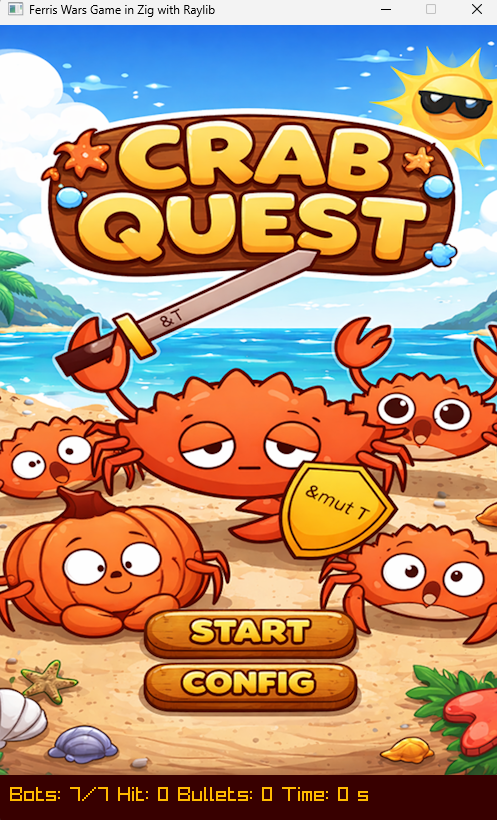
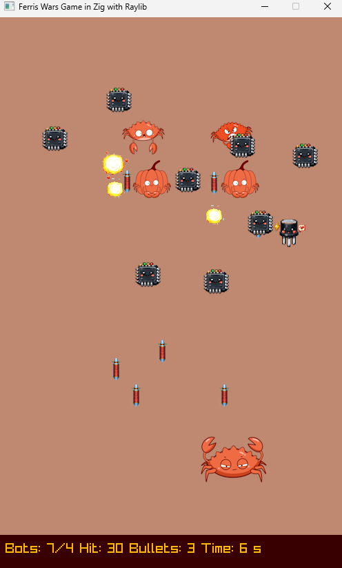
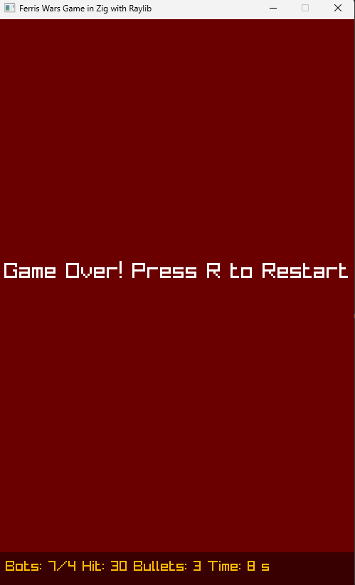
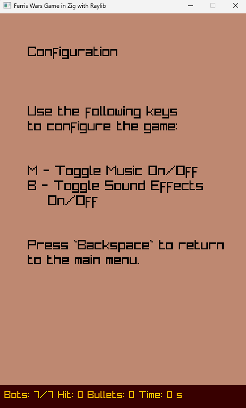
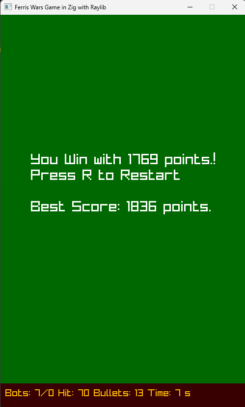

# Ferris Wars Game Design Document

Version 0.1

## Table of Contents

- [1. Game Overview](#1-game-overview)
- [2. Gameplay Mechanics](#2-gameplay-mechanics)
- [3. Game World](#3-game-world)
- [4. Characters](#4-characters)
- [5. User Interface](#5-user-interface)
- [6. Art and Sound](#6-art-and-sound)
- [7. Development Roadmap](#7-development-roadmap)
- [8. Technical Details](#8-technical-details)

## 1. Game Overview

Ferris Wars is a 2D arcade-style shooter where players control Ferris, the Rust programming language mascot, in a battle against waves of enemy bots. The game combines classic space shooter mechanics with modern scoring systems, offering an engaging experience for both casual gamers and programming enthusiasts.

- **Name:** Ferris Wars
- **Genre:** Arcade, Shoot 'em Up, Action
- **Platform:** PC, Mac, Linux (Cross-platform via Zig and Raylib)
- **Target Audience:** Casual gamers, programming enthusiasts, retro arcade fans
- **Game Engine:** Built with Zig programming language and Raylib graphics library
- **Core Loop:** Shoot enemies, avoid obstacles and projectiles, maximize score through accuracy and speed

## 2. Gameplay Mechanics

### 2.1 Player Controls

Players control Ferris using keyboard inputs:

- **Arrow Keys:** Move in all four directions (Up, Down, Left, Right)
- **Spacebar:** Fire bullets at enemies
- **R Key:** Restart the game after winning or losing
- **M Key:** Toggle background music on/off (in configuration menu)
- **B Key:** Toggle sound effects on/off (in configuration menu)
- **Enter:** Start game from main menu
- **Backspace:** Return to main menu from configuration screen

### 2.2 Core Mechanics

**Player Movement:**

- The player can move freely within the game arena boundaries
- Movement speed: 250 pixels per second
- Player size: 96x67 pixels
- Movement is constrained to the play area (750 pixels height)

**Shooting System:**

- Maximum 5 active bullets at once
- Bullet speed: 300 pixels per second (upward)
- Bullet cooldown: 0.3 seconds between shots
- Bullets automatically deactivate when leaving the screen
- Sound effects play on shooting (if enabled)

**Enemy Behavior:**

- Enemies (bots) spawn in random formations at the start
- Bots move vertically downward at 60 pixels/second
- Bots have horizontal sinusoidal movement (40 pixel amplitude)
- Bots wrap around to the top when reaching the bottom
- Each bot can shoot bullets downward
- Bot shooting cooldown: Random between 3-8 seconds
- Bot bullet speed: 150 pixels per second
- Maximum 5 bullets per bot

### 2.3 Game Objectives

**Primary Objective:** Destroy all enemy bots in the formation

**Win Condition:** Eliminate all bots without being destroyed

**Lose Conditions:**

- Collision with an enemy bot
- Hit by an enemy bullet
- Collision with a chip obstacle

### 2.4 Scoring System

The game features a sophisticated scoring system that rewards both speed and accuracy:

**Base Score:**

- 100 points per bot destroyed
- Total base = (Number of bots × 100)

**Time Bonus:**

- Starts at 1000 points
- Decreases by 50 points per second
- Bonus = max(0, 1000 - elapsed_time × 50)

**Accuracy Bonus:**

- Starts at 500 points
- Penalty: 10 points per extra bullet fired beyond the number of bots
- Bonus = max(0, 500 - (bullets_fired - total_bots) × 10)

> Final Score = Base Score + Time Bonus + Accuracy Bonus

## 3. Game World

### 3.1 Game Arena

The game takes place in a single arena with the following characteristics:

- **Screen Size:** 500×800 pixels
- **Play Area:** 500×750 pixels (top 750 pixels)
- **HUD Area:** 500×50 pixels (bottom 50 pixels)
- **Background:** Brownish-beige color scheme (RGB: 190, 136, 113)

### 3.2 Enemy Formations

The game features 7 different pre-defined bot formations:

1. **Diamond Pattern:** Bots arranged in corners and center
2. **Cross Pattern:** Alternating bot positions forming a cross
3. **Checkerboard:** Alternating rows and columns
4. **Vertical Columns:** Three columns of bots
5. **Arrow/Tree:** Pyramid shape pointing down
6. **Inverted Triangle:** Wide at top, narrow at bottom
7. **Pyramid:** Building up from bottom

- Formation grid: 4 rows × 5 columns
- Each formation contains 8-20 bots depending on pattern
- Formations spawn above the visible area and descend
- Random formation selected at game start

### 3.3 Obstacles

**Chips:**

- Small rotating obstacles scattered across the play area
- 8 chips spawn per game at random positions
- Size: 36×36 pixels
- Animated with rotation effects
- Temporary lifetime: 10-25 seconds (random)
- Minimum spacing: 80 pixels apart
- Contact with chips causes instant game over

**Jumper:**

- A special moving obstacle that bounces around the arena
- Size: 64×64 pixels
- Moves diagonally at varying speeds
- Bounces off walls when hitting boundaries
- Speed: 60 pixels/second horizontally, 30 pixels/second vertically
- Direction reverses upon wall collision

### 3.4 Visual Effects

**Explosions:**

- Triggered when a bot is destroyed
- Maximum 10 active explosions at once
- Animated sprite-based explosion effect
- Positioned at the center of destroyed bots
- Sound effect plays on explosion (if enabled)

## 4. Characters

### 4.1 Player Character - Ferris

**Description:** The Rust programming language mascot, depicted as a stylized crab

**Attributes:**

- Health: One-hit kill (any collision results in game over)
- Speed: 250 pixels/second
- Size: 96×67 pixels
- Starting position: Center bottom of screen

**Abilities:**

- Omnidirectional movement within play area
- Rapid-fire shooting with cooldown
- Can fire up to 5 bullets simultaneously

### 4.2 Enemy Bots

**Description:** Various Ferris-themed enemy characters

**Types:** Multiple bot sprites (randomly assigned)

**Attributes:**

- Size: 64×64 pixels
- Vertical speed: 60 pixels/second
- Horizontal oscillation: 40 pixels amplitude
- Health: One hit to destroy
- Point value: Contributes to base score

**Behavior:**

- Spawn in formation patterns
- Move in sinusoidal patterns downward
- Shoot bullets at random intervals
- Wrap to top when reaching bottom
- Each bot tracks player position for targeting

### 4.3 Obstacles

**Chips:**

- Rotating microchip-like obstacles
- Hazardous to player on contact
- Temporary presence in arena

**Jumper:**

- Bouncing animated character
- Moves in diagonal patterns
- Constant threat requiring awareness

## 5. User Interface

### 5.1 Main Menu Screen

**Elements:**

- Cover image/title screen
- "Start Game" button
- "Configure" button
- Activated by Enter key or mouse click



### 5.2 Configuration Menu

**Elements:**

- Music toggle (M key) - On/Off
- Sound effects toggle (B key) - On/Off
- Backspace to return to main menu
- Clean centered text display



### 5.3 HUD (Heads-Up Display)

Located at the bottom of the screen, displaying:

- **Total Bots:** Initial number of enemies
- **Remaining Bots:** Current enemies left to destroy
- **Current Score:** Real-time score calculation
- **Bullets Fired:** Total shots taken
- **Elapsed Time:** Time in seconds since game start

**Design:**

- Dark red background (RGB: 56, 0, 0)
- Gold/yellow text (RGB: 255, 186, 0)
- Font size: 20 pixels
- Left-aligned text format

### 5.4 Game Over Screens

**Victory Screen:**

- Green background (RGB: 0, 104, 0)
- Displays final score
- Shows best score comparison
- "Press R to Restart" prompt
- Victory sound effect



**Defeat Screen:**

- Dark red background (RGB: 107, 0, 0)
- "Game Over" message
- "Press R to Restart" prompt
- Defeat sound effect



### 5.5 Gameplay Screen

**Visual Layout:**

- Play area occupies upper 750 pixels
- Enemies, player, obstacles, and bullets visible
- Explosion animations on bot destruction
- Animated obstacles (chips and jumper)
- HUD bar at bottom



## 6. Art and Sound

### 6.1 Visual Style

**Art Direction:**

- Retro arcade aesthetic
- Sprite-based 2D graphics
- Clean, readable character designs
- Rust/Ferris themed visual identity

**Color Palette:**

- Background: Warm brown/beige tones
- HUD: Dark red with gold accents
- Victory: Deep green
- Defeat: Dark red
- High contrast for readability

**Animation:**

- Sprite-based animation system
- Explosion effects with frame-based animation
- Rotating chip animations
- Jumper character animation
- Smooth 60 FPS gameplay

### 6.2 Sound Design

**Music:**

- Background level music (looping)
- Can be toggled on/off
- Stops during game over/victory screens

**Sound Effects:**

- Shooting sound (player bullets)
- Explosion sound (bot destruction)
- Victory fanfare
- Defeat/losing sound
- All effects can be toggled independently

**Audio Implementation:**

- Raylib audio system
- Non-blocking sound playback
- Checks to prevent sound overlap

## 7. Development Roadmap

### Current Version (v0.1)

**Implemented Features:**

- [x] Core shooting mechanics
- [x] Enemy formations and AI
- [x] Collision detection
- [x] Scoring system
- [x] Obstacle system (chips and jumper)
- [x] Audio system with toggles
- [x] Save/load best score
- [x] Main menu and configuration
- [x] Win/lose conditions

### Future Enhancements

**Planned Features:**

- [ ] Multiple difficulty levels
- [ ] Different enemy types with unique behaviors
- [ ] Power-ups system
- [ ] Progressive levels with increasing difficulty
- [ ] More formation patterns
- [ ] Boss battles
- [ ] Player lives system *(multiple hits)*
- [ ] Shield/invincibility power-ups
- [ ] Combo system for consecutive hits
- [ ] Online leaderboards
- [ ] Achievement system

**Code Improvements:**

- [ ] Refactor codebase for better modularity
- [ ] Improved configuration menu design
- [ ] State machine optimization
- [ ] Asset loading improvements
- [ ] Better separation of concerns

## 8. Technical Details

### 8.1 Technology Stack

- Programming Language: Zig 0.15.1
- Graphics Library: Raylib (raylib-zig bindings)

### 8.2 Architecture

**Main Components:**

1. **main.zig** - Game loop and state management
   - Initializes window and audio
   - Main game loop
   - State machine for game screens
   - Input handling

2. **game.zig** - Core game logic
   - Game state management
   - Entity management (bots, chips, jumper)
   - Collision detection
   - Score calculation
   - Formation loading

3. **player.zig** - Player entity
   - Movement logic
   - Shooting mechanics
   - Collision detection
   - Bullet management

4. **bot.zig** - Enemy bot entity
   - Movement patterns (vertical + sinusoidal)
   - AI behavior
   - Shooting logic
   - Bullet management

5. **chip.zig** - Chip obstacle
   - Animation handling
   - Lifetime management
   - Collision detection

6. **jumper.zig** - Jumper obstacle
   - Bouncing movement
   - Direction management
   - Collision detection

7. **bullet.zig** - Player bullet projectile
8. **botBullet.zig** - Enemy bullet projectile
9. **animations.zig** - Animation system *(explosions, chips, jumper)*
10. **assetServer.zig** - Asset loading and management
11. **config.zig** - Game constants and configuration
12. **data.zig** - Score persistence (save/load)
13. **formation.zig** - Enemy formation patterns
14. **designer.zig** - UI text and button elements
15. **textBlock.zig** - Text rendering utilities
16. **button.zig** - Button UI components

### 8.3 Build System

**Build Tool:** Zig build system (build.zig)

- Manages dependencies
- Cross-compilation support
- Links Raylib bindings

**Dependencies:** Managed via build.zig.zon

- raylib-zig bindings

**Running the Game:**

```bash
zig build run
```

### 8.4 Data Persistence

**Score System:**

- Stores best score in `scores.dat` file
- Format: CSV (elapsed_time, score)
- Loads on game start
- Saves when beating previous best score
- Falls back to zero if file not found

### 8.5 Performance Specifications

**Target Frame Rate:** 60 FPS
**Resolution:** 500×800 pixels (fixed)
**Memory Management:** Manual allocation with Zig allocators
**Collision Detection:** AABB (Axis-Aligned Bounding Box) rectangles

### 8.6 Configuration Constants

**Game Settings:**

- Screen: 500×800 pixels
- Play area: 750 pixels height
- FPS: 60

**Player:**

- Speed: 250 px/s
- Size: 96×67 px
- Max bullets: 5
- Bullet cooldown: 0.3s

**Enemies:**

- Size: 64×64 px
- Max count: 20
- Vertical speed: 60 px/s
- Horizontal range: 40 px

**Obstacles:**

- Chips: 8 total, 36×36 px
- Chip lifetime: 10-25 seconds
- Max explosions: 10

All constants are defined in [config.zig](../src/config.zig) for easy tuning.
